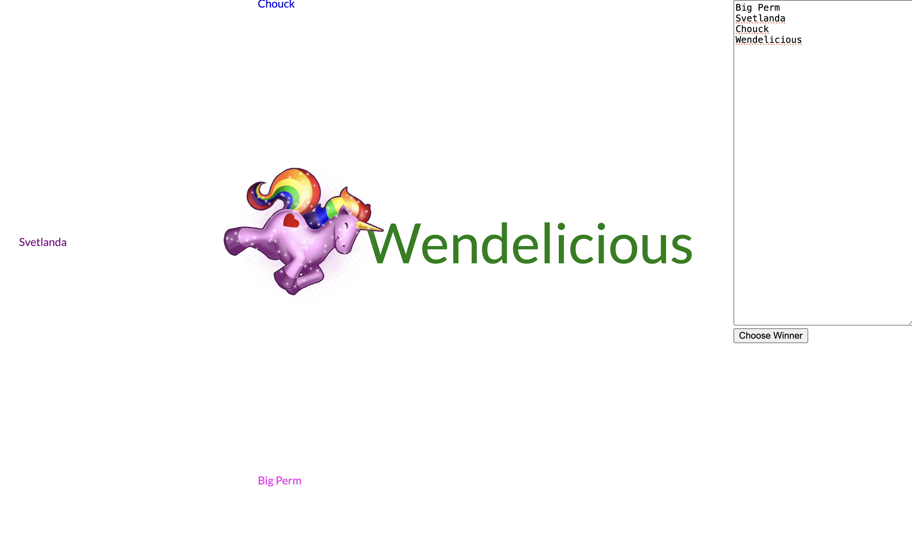

# Unicorn Roulette

A simple web app for randomly selecting a winner.

## Background

For fifteen years, the engineering teams I've run have ended the week with a ceremony where each person on the team shows off the work they completed that week. It has always been a fun celebratory way to end the week. 

We started this ceremony at [Gnip](https://en.wikipedia.org/wiki/Gnip), a startup I was at many years ago. One of the engineers on our team, Eric Wendelin, put together this hilarious spinning unicorn that helped us randomly select a winner. Putting this out into the ether for all to experience the joy of the unicorn.

## What it does

- Enter a list of names (one per line)
- Click "Choose Winner"
- Watch the unicorn spin and point to the demo winner

Simple as that.

## How to use it

1. Clone the repo

2. Open `UnicornRoulette.html` in your browser

3. Enter names in the text area, one per line

4. Click "Choose Winner"

## Features

- Rainbow-colored names that rotate around the unicorn
- The selected name scales up 5x
- Pure vanilla JavaScript - no dependencies

## Technical details

Built with:
- HTML/CSS/JavaScript
- A unicorn GIF

The app calculates positions for each name around a circle, then rotates the unicorn to point at the randomly selected winner. Each name gets a different color.

## Why a unicorn?

Why not? It made our Friday demos more fun, and after so many years, it's become a tradition worth sharing.

## License

Do whatever you want with it. Enjoy.

---

*May the demo gods smile upon thee and your Fridays end on a high note.*